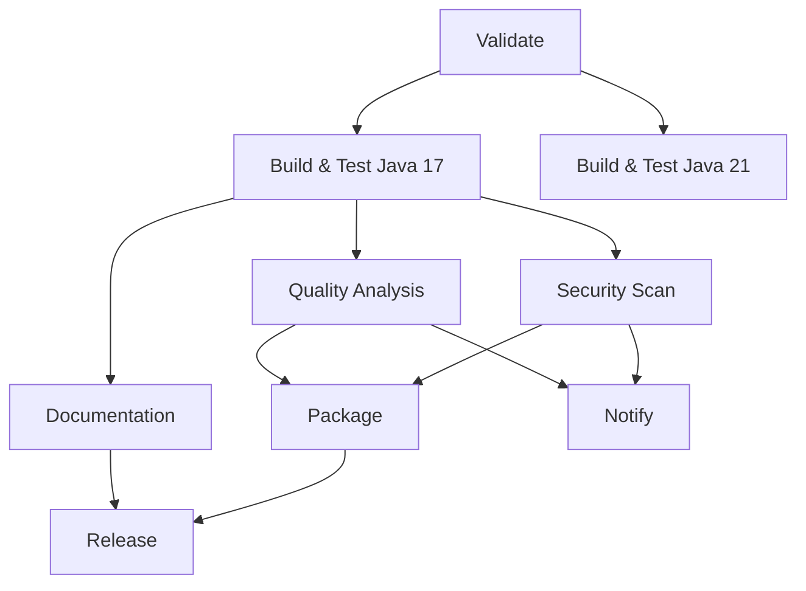

# GitLab CI/CD Pipeline - FIAE24M Kassensystem

## 📋 Übersicht

Diese GitLab CI/CD Pipeline ist das Äquivalent zur GitHub Actions Pipeline und bietet die gleiche umfassende Funktionalität für das FIAE24M Kassensystem. Die Pipeline ist für **GitLab Shared Runner** optimiert und läuft ohne weitere Konfiguration.

## 🎯 Pipeline-Features

### 7 Hauptstages mit vollständiger Funktionalität:

#### 1. **Validation Stage**
- Projektstruktur-Validierung
- Maven-Konfiguration prüfen

#### 2. **Build & Test Stage** 
- **Matrix Build**: Java 17 & 21
- Unit-Tests (50+ Tests)
- Code Coverage (JaCoCo)
- Test-Reports

#### 3. **Quality Analysis Stage**
- **SpotBugs**: Bug-Pattern-Erkennung
- **PMD**: Code-Qualitätsanalyse  
- **Checkstyle**: Code-Style-Prüfung
- **Maven Site**: Umfassende Reports

#### 4. **Security Scan Stage**
- **OWASP Dependency Check**
- Vulnerability Reports
- SAST Integration

#### 5. **Package Stage**
- Standard JAR Creation
- Fat JAR (mit Dependencies)
- Build-Informationen

#### 6. **Documentation Stage**
- JavaDoc Generierung
- Maven Site Dokumentation
- **GitLab Pages** Integration

#### 7. **Release Stage**
- GitLab Release Creation
- Automatische Asset-Uploads
- Release Notes

#### 8. **Notification Stage**
- Success/Failure Notifications
- Pipeline-Statistiken

## 🚀 Setup & Konfiguration

### 1. GitLab Runner Setup

#### Shared Runner (Empfohlen)
Die Pipeline ist konfiguriert für GitLab Shared Runner:
```yaml
# Keine tags-Konfiguration erforderlich
# Pipeline läuft automatisch auf verfügbaren Shared Runnern
```

**Vorteile:**
- Keine Runner-Installation erforderlich
- Automatische Skalierung
- Wartungsfrei
- Sofort einsatzbereit

#### Self-Hosted Runner (Optional)
Für spezielle Anforderungen kann ein Self-Hosted Runner eingerichtet werden:
```bash
# GitLab Runner installieren
curl -L "https://packages.gitlab.com/install/repositories/runner/gitlab-runner/script.deb.sh" | sudo bash
sudo apt-get install gitlab-runner

# Runner registrieren
sudo gitlab-runner register \
  --url "https://gitlab.com/" \
  --registration-token "YOUR_TOKEN" \
  --executor "docker" \
  --docker-image "openjdk:17-alpine" \
  --description "custom-runner" \
  --tag-list "custom"

# Runner starten
sudo gitlab-runner start
```

### 2. Required Software

#### Docker Images (automatisch):
- `openjdk:17-alpine` (Haupt-Build)
- `openjdk:21-alpine` (Java 21 Matrix)
- `registry.gitlab.com/gitlab-org/release-cli:latest` (Releases)

#### Maven Dependencies:
- Automatisches Caching in `.m2/repository/`
- Alle Plugins aus `pom.xml` werden verwendet

### 3. GitLab-spezifische Variablen

```yaml
variables:
  MAVEN_OPTS: "-Dmaven.repo.local=$CI_PROJECT_DIR/.m2/repository"
  MAVEN_CLI_OPTS: "--batch-mode --errors --fail-at-end --show-version"
```

## 📊 Pipeline-Ablauf

### Trigger-Bedingungen:
- **Push** auf `main`, `develop`, `feature/*`
- **Merge Requests**
- **Git Tags** (für Releases)

### Stage-Abhängigkeiten:


## 🔧 Konfiguration & Anpassungen

### 1. Runner-Tags anpassen:
```yaml
# Wenn andere Runner verwendet werden:
tags:
  - your-runner-tag  # statt mmbbs3
```

### 2. Java-Versionen ändern:
```yaml
# Zusätzliche Java-Versionen hinzufügen:
build-test-java11:
  <<: *build-test-template
  image: openjdk:11-alpine
```

### 3. Quality Gates:
```yaml
# Strikte Quality Gates aktivieren:
script:
  - mvn checkstyle:check  # ohne "|| echo"
  - mvn pmd:check
  - mvn spotbugs:check
```

### 4. GitLab Pages aktivieren:
```yaml
# In GitLab Projekt Settings > Pages
pages:
  # Job läuft automatisch für main branch
```

## 📈 Artifacts & Reports

### Build Artifacts:
- **JAR Files**: Standard + Fat JAR
- **Test Reports**: JUnit XML + HTML
- **Coverage Reports**: JaCoCo XML + HTML
- **Quality Reports**: SpotBugs, PMD, Checkstyle
- **Documentation**: JavaDoc + Maven Site

### GitLab Integration:
- **Test Results**: Automatisch in GitLab angezeigt
- **Code Coverage**: Coverage Badge verfügbar
- **Security Reports**: SAST Integration
- **Code Quality**: Quality Reports

## 🚀 Vergleich GitHub Actions vs GitLab CI

| Feature | GitHub Actions | GitLab CI | 
|---------|---------------|-----------|
| **Matrix Builds** | ✅ strategy.matrix | ✅ Template-Vererbung |
| **Caching** | ✅ actions/cache | ✅ cache: paths |
| **Artifacts** | ✅ upload-artifact | ✅ artifacts: paths |
| **Releases** | ✅ GitHub Releases | ✅ GitLab Releases |
| **Pages** | ✅ GitHub Pages | ✅ GitLab Pages |
| **Security** | ✅ CodeQL | ✅ SAST Integration |
| **Self-hosted** | ✅ [self-hosted] | ✅ tags: [runner] |

## 🔄 Migration von GitHub Actions

### 1. Datei-Setup:
```bash
# .gitlab-ci.yml ins Repository root
cp .gitlab-ci.yml /path/to/repo/
git add .gitlab-ci.yml
git commit -m "Add GitLab CI/CD Pipeline"
```

### 2. Secrets/Variables:
- GitLab Project Settings > CI/CD > Variables
- Übertrage GitHub Secrets zu GitLab Variables

### 3. Runner konfigurieren:
- Self-hosted: Registriere GitLab Runner mit Tag `mmbbs3`
- Shared: Anpassung der Tags in `.gitlab-ci.yml`

## 🔍 Troubleshooting

### Häufige Probleme:

#### 1. Runner nicht verfügbar:
```yaml
# Tags prüfen und anpassen
tags:
  - available-runner-tag
```

#### 2. Maven Cache:
```bash
# Cache löschen falls Probleme
gitlab-runner exec docker --cache-dir /tmp/cache cleanup
```

#### 3. Permissions:
```yaml
# Docker-in-Docker für Runner
services:
  - docker:dind
```

## 📚 Weiterführende Links

- [GitLab CI/CD Documentation](https://docs.gitlab.com/ee/ci/)
- [GitLab Runner Installation](https://docs.gitlab.com/runner/install/)
- [GitLab Pages Setup](https://docs.gitlab.com/ee/user/project/pages/)
- [FIAE24M Kassensystem Repository](./README.md)

---

**Pipeline Status**: [](https://gitlab.com/YOUR_USERNAME/FIAE24M_Kasse/-/commits/main)

**Coverage**: [](https://gitlab.com/YOUR_USERNAME/FIAE24M_Kasse/-/commits/main)
